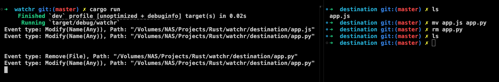

# Watchr

A simple and efficient Rust library for watching file system changes. It is built on top of [notify](https://github.com/notify-rs/notify) and [tokio](https://tokio.rs) crates.

## Features

1. Simple API for watching file system changes like creation, modification, deletion and renaming
2. Fully async-compatible using `tokio` runtime
3. Provides wrapper over `notify` events



## Installation

Add `watchr` to your `Cargo.toml`:

```toml
[dependencies]
watchr = "0.1.0"
```

## Usage

```rust
use watchr::FileWatcher;

let watcher = FileWatcher::new(vec![PathBuf::from("./destination")]);

watcher.watch(callbackFunction);
```

## License

This project is released under the [MIT License](LICENSE).
